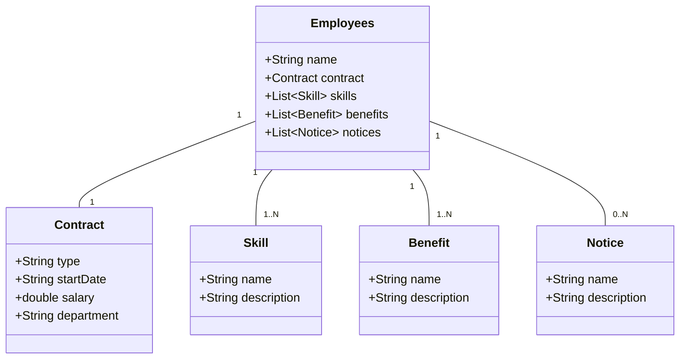

# Empresa Fake 2025 - Cenário do Funcionário 
Java RESTful criada para a Empresa Fake.

## Diagrama de classes

```mermaid
classDiagram
    class Employees {
        +String name
        +Contract contract
        +List~Skill~ skills
        +List~Benefit~ benefits
        +List~Notice~ notices
    }

    class Contract {
        +String type
        +String startDate
        +double salary
        +String department
    }

    class Skill {
        +String name
        +String description
    }

    class Benefit {
        +String name
        +String description
    }

    class Notice {
        +String name
        +String description
    }

    Employees "1" -- "1" Contract 
    Employees "1" -- "1..N" Skill 
    Employees "1" -- "1..N" Benefit 
    Employees "1" -- "0..N" Notice 
```
